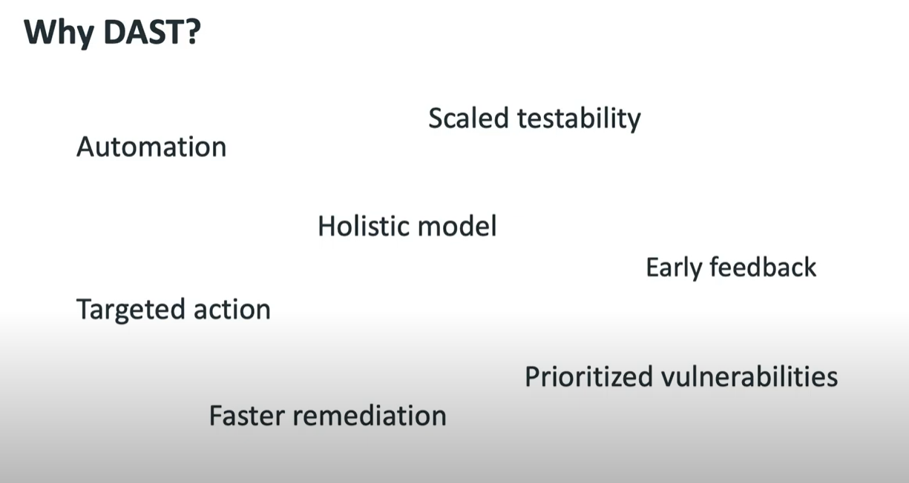

# SAST Vs DAST

## SAST (Static Application Security Testing):

- It focus on source code
- In this, Application is not deployed yet.
- Used at Development State
- Example: SQL Injection etc. 

## DAST ( Dynamic Application Security Testing):

- Testing Security Vulnerabilities in Running Application
- Automated Pen Testing
- Application Auditing
- Vulnerability results
- it gives results close to actual exploit. 

Examples: SSL checks, TLS algorithms, Weak Ciphers check etc. 

### Why DAST? 

- Less Noise as its more similar to what human will do. 
- No need to know how API is built in 
- it provides holistic application security

### What is Future of DAST? 
- we focus on Holistic App Security
- Focus on Integrated Testing
- Increased Automation and accuracy

