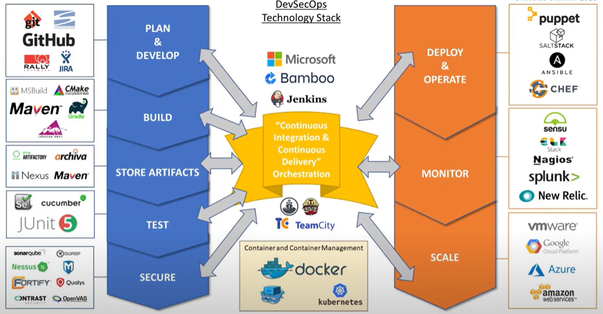

# DevOps vs DevSecOps intro 

## DevOps

- Organizations that incorporate DevOps simply get more done
- DevOps eliminates silos and promotes teamwork and collaboration
- DevOps Team can deliver at a faster pace, innovate and bring new features to life
- And all this happens wile solving problems, increasing Employee productivity, communication, engagements, and making environment more stable and secure. 

## DevSecOps

- While DevOps establish new culture within organizarion with some of key benefits as above, but because security and compliance remain top priority, its next generation integrates Securiy and Compliance in DevOps LifeCycle, creating DevSecOps

- Unfortunately DevSecOps implementation is not simple. 

- it requires a lot of technology stacks with several solutions that need to be carefully integrated to successfully deploy the DevSecOps culture without creating gaps in security or creating bottlenecks 

- so one of our most important tools of your DevSecOps stack is your Continuous Integration and Continuous Delivery Solution( CI/CD) Solution. 

- it orchestrates all the moving parts and ensures that everything is properly integrated and automated to make the magic happen.

### DevSecOps Toolset: 

- there are multiple CI/CD solutions that are available: Jenkins, Azure DevOps, Bamboo, Travis CI etc. 

- Now we have CI/CD tool, first component of DevOps stack is **Plan/Devlop** capability

- This capability allows users for creation of user stories , planning Sprints, and of course to code. 
- "Plan/Devlop" capability solutions includes GIT/Bitbucket, JIRA, Confluence, IntelliJIdea etc
- Next comes the Build capability which takes the code and like the name suggests "Builds" it
- it includes tools like Maven, Ant, Gradle, MSBuild etc. 

- Now you need to securely store artifacts created during build as well as your third part and custom libraries. This is much more effective than using version control System.

- This also ensures libraries you are using are always at their latest versions and shared across your team.
Securely.We have Artifactory and Nexus as more popular tools here
  
- "Testing" is key part of your DevSecOps stack allowing you to automate your unit, functional, regression and integration tests and more. 

- We are using Junit and Bounty for unit Testing and Integration testing here. These solutions helps run tests automatically prior to deployment.

- Of Course DevSecOps won't be what its name says without the word "Secure" this is where your code will be scanned for vulnerabilities, and your containes for open ports and vulnerabilities. 

- Security Solutions include Sonarqube, NexusIQ, Fortify, Contrast Security, Qualys, NuVector,  etc. which helps achieving the same. 

-  Onto next capability, "Deploy and Operate" the ability to manage configuration requirements and push your builds into deployment is critical. 

- we use SaltStack, Ansible, Jenkins, Docker, Kubernetes etc, for same. 

-  Now that your Application is deployed we need to continuously monitor it 

- We are using Nagios, Splunk, Prometheus for continuous monitoring and logs. 

- We also need to scale and avile benefits of cloud elasticity which we do using Cloud Solutions provider like Azure, AWS, GoogleCloud and also internal cloud called CloudServe

- Building the DevSecOps stack that enables you to continuously integrate and deliver your Software isn't a small task but it will be worth it if you leverage the right development principles 

- MicroServices and Containers(such as Docker) technology helps you deploy your Software on any Cloud with ease. 

- And Container Management Solutions such as Kubernetes and OpenShift allows us to orchestrate and manage those containers at scale. 

